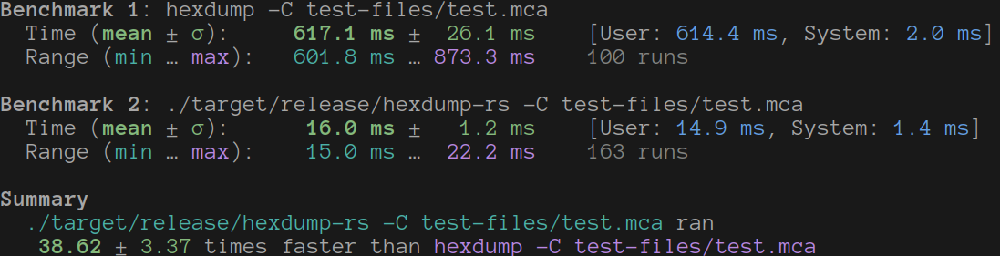
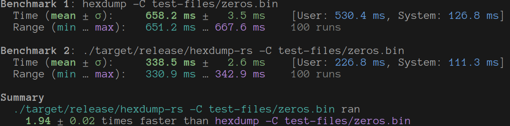
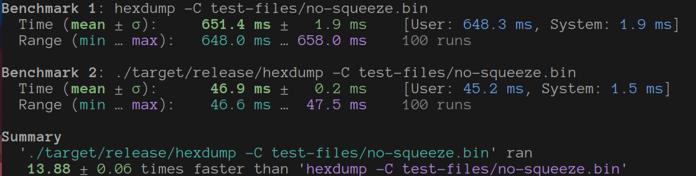

# hexdump-rs

(name tbd)

A rewrite of `hexdump` in Rust, which offers up to a 14x speedup

Test with a (semi) random 7.8M file:


Test with a 1.1G file with all zeros:


Test with a 8.5M file that can't be squeezed (all lines differ from the previous):


## Compatibility

This is meant to be a drop-in replacement for `hexdump -C` since that
seems to be the most common usage of hexdump.  I'd like to implement the
other features of hexdump in the future.

## Testing

There is a small python script in the `test-files/` directory that I
used to generate some of the files mentioned above.

I then used [`hyperfine`](https://github.com/sharkdp/hyperfine) to
compare the speed of the program using the following command (replacing
`[FILE]` with the file to test).

```sh
hyperfine -m 100 '{command} -C {file}' -L command 'hexdump,./target/release/hexdump' -L file '[FILE]' --warmup 5
```

## Contributions

Issues and PRs are welcome!  If you have an idea to speed it up or would
like to request a feature, file an issue/pr!

